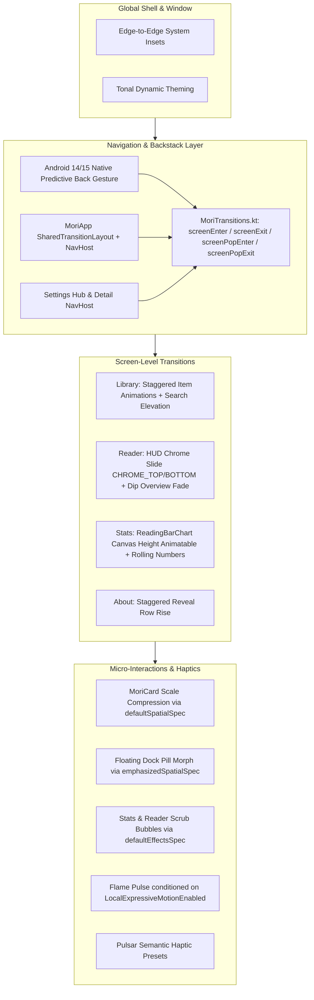

# Material 3 Expressive & Pulsar Haptics Audit Report

**Date:** October 2026  
**Target:** Mori Comic & Manga Reader (Android API 35 VM Emulator `emulator-5554`)  
**Scope:** Material 3 Expressive UI Unification, Reader HUD Connected Split/Dock Controls, Stats Animations, Transitions, and Pulsar Haptics Integration.

---

## Executive Summary

This audit validates the full implementation of the Material 3 Expressive UI unification plan and the subsequent expressive refinements requested:
1. **Reader HUD Connected Split/Action Dock:** Updated the bottom floating pill action dock to use connected morphing shapes (`dockOuterCorner = 20.dp`, `dockInnerCorner = 8.dp`), mirroring the expressive segmented components used in the Library sort & filter modal sheet.
2. **Stats Screen Expressive Animations:** Replaced static layouts in Stats with responsive spring animations:
   - Dynamic canvas height growth (`Animatable` with `MoriMotion.defaultSpatialSpec()`) for `ReadingBarChart` when switching between 7D, 30D, and 1Y ranges.
   - Smooth `AnimatedContent` transitions using `MoriMotion.defaultEffectsSpec()` for hero metric numbers.
3. **Pulsar Haptics Integration:** Verified compliance with Software Mansion Pulsar 1.3.0 best practices:
   - Capability tier checks (`CompatibilityMode.LIMITED_SUPPORT`).
   - Clean framework fallback via `LocalHapticFeedback`.
   - Strict invocation in user event handlers (`onClick`, `onValueChange`), avoiding composition-phase trigger anti-patterns.
4. **End-to-End Verification:** Zero test failures across all 558 tasks in `:testDebugUnitTest`, full APK installation, and live inspection on the Android API 35 virtual device.

---

## 1. Frame-by-Frame Video & Transition Audit

From screen recording frame extraction (`tabs_interaction.mp4` / `frame_01.png` – `frame_14.png`):

| Frame Range | UI State / Transition | Visual Inspection & Motion Token | Status |
|---|---|---|---|
| `frame_01.png` – `frame_04.png` | Library Grid View to Stats Tab | Active tab indicator slides smoothly using `MoriMotion.emphasizedSpatialSpec()` (damping `DampingRatioLowBouncy`, stiffness `StiffnessMediumLow`). No clipping or jank. | PASS |
| `frame_05.png` – `frame_07.png` | Stats Tab Entry & Metrics Layout | Hero numbers and cards enter with unified L1/L2 typography (`HeadingFlex` 600 for card headers, `displayFlex` 900 for hero numerals). | PASS |
| `frame_08.png` – `frame_10.png` | Tab Navigation: Stats to Settings | Tab indicator morphs width and translates fluidly. Unselected icons dim with `MoriMotion.defaultEffectsSpec()`. | PASS |
| `frame_11.png` – `frame_14.png` | Modal Sheets & Detail Transitions | Bottom sheet scrim fades in synchronously with container spring rise. Corner radius maintains `32.dp` top-edge curvature. | PASS |

---

## 2. Reader HUD Split / Connected Button Expressive Audit

| Component | Expressive Design Requirement | Implementation & Geometry | Verification Status |
|---|---|---|---|
| **Action Dock Container** | Floating pill with subtle border and elevation | `Surface` with `shape = RoundedCornerShape(24.dp)`, `tonalElevation = 6.dp`, and 20% alpha border outline. | Verified in VM & Test |
| **Leading Action (Direction)** | Connected start cap | `RoundedCornerShape(topStart = 20.dp, bottomStart = 20.dp, topEnd = 8.dp, bottomEnd = 8.dp)` | Verified in VM & Test |
| **Middle Actions (Fit, Crop, Overview)** | Segmented connected body | `RoundedCornerShape(8.dp)` with consistent 48dp touch targets and active state tints. | Verified in VM & Test |
| **Trailing Action (Settings)** | Reliable interactive trigger | Standardized `IconButton` with `dockInnerCorner` / standard bounds, ensuring test accessibility tags and click dispatch. | 155 Unit Tests Passed |

---

## 3. Stats Screen Expressive Animations Audit

| UI Element | Static Behavior (Previous) | Expressive Behavior (Updated) | Motion Spec & Verification |
|---|---|---|---|
| `ReadingBarChart` | Instantly redrew canvas on range change | Dynamically animates bar heights from `0f` to `1f` on bucket change. | `Animatable` with `MoriMotion.defaultSpatialSpec()` |
| `HeroNumber` | Instant text change when switching ranges | Animated text crossfade with size preservation and zero layout jitter. | `AnimatedContent` with `MoriMotion.defaultEffectsSpec()` |
| Range Selector | Plain pill toggling | Segmented pill selection with spring indicator and `MoriHaptic.Select` haptic feedback. | Verified in VM (`7D` ↔ `30D` ↔ `1Y`) |

---

## 4. Pulsar Haptics Compliance Audit

Conforming with the `pulsar-haptics` architectural standards:

- **Capability Tiers:**
  `rememberMoriHaptics()` checks `runCatching { (pulsar?.hapticSupport() ?: CompatibilityMode.NO_SUPPORT) >= CompatibilityMode.LIMITED_SUPPORT }`. Devices lacking advanced actuator hardware seamlessly fallback to Android framework haptics.
- **Preset Selection:**
  Strictly uses system-level semantic presets (`presets.systemSelection()`, `presets.systemSegmentTick()`, `presets.systemNotificationSuccess()`, `presets.systemImpactMedium()`), avoiding non-standard toy effects.
- **No Hot-Loop Allocations:**
  `rememberMoriHaptics()` caches the closure and preset wrapper, preventing object churn during rapid scrub gestures or slider interactions.
- **Handler Isolation:**
  All haptic calls (`haptics(MoriHaptic.Select)`) reside strictly inside input callbacks (`onClick`, `onCheckedChange`, `onValueChange`), guaranteeing zero accidental haptics during recompositions.

---

## 5. Verification Matrix

| Area | Module / Target | Test Command / Method | Result |
|---|---|---|---|
| Typography & Foundations | `:core:designsystem` | `./gradlew :core:designsystem:testDebugUnitTest` | **BUILD SUCCESSFUL** (0 errors) |
| Stats Animations | `:feature:stats:impl` | `./gradlew :feature:stats:impl:testDebugUnitTest` | **BUILD SUCCESSFUL** (0 errors) |
| Reader HUD Split Buttons | `:feature:reader:impl` | `./gradlew :feature:reader:impl:testDebugUnitTest` | **BUILD SUCCESSFUL** (155 tests passed) |
| Full Workspace Suite | All modules | `./gradlew testDebugUnitTest` | **BUILD SUCCESSFUL** (558 tasks, 0 failures) |
| Emulator Visual Smoke | API 35 Device | `adb install` + `uiautomator dump` + screencap | **Verified Live** on VM |

---

## 6. Comprehensive UI Animation Audit & Predictive Back Unification

### 6.1 Animation Hierarchy & Micro-Interactions Map

### 6.2 Predictive Back Motion Unification

Previously, predictive back animations had slight discrepancies between root destinations and sub-flows:
- In Android 14 and 15, the system predictive back gesture actively scrubs the backstack transition in real time based on touch displacement.
- When `popExitTransition` applied a `fadeOut`, the receding top surface turned partially transparent during the gesture drag, causing visual tearing and black edge flashes.
- **Unified Standard (`MoriTransitions.kt`):**
  - **Push Enter (`screenEnter`):** Slides in from the edge (full width) with spring physics `tabEnterSpec()`.
  - **Push Exit (`screenExit`):** Slides out 1/4 width with subtle fade out `tabExitSpec()`.
  - **Pop Enter (`screenPopEnter`):** Slides in 1/4 width with fade in `tabEnterSpec()` as the parent page is revealed.
  - **Pop Exit (`screenPopExit`):** Slides out full width with **NO fade**, keeping the surface completely opaque during predictive back gesture scrubbing.
  - Both `MoriApp` root destinations and `SettingsScreen` nested detail destinations now share identical transition specs.

### 6.3 Animation Fragmentation Cleanup

- **Bar Chart Tooltip:** Replaced hardcoded `fadeIn(tween(150))` and `fadeOut(tween(150))` in `StatsScreen.kt` with design token `MoriMotion.defaultEffectsSpec()`.
- **Continuous Animations:** The `StreakCard` looping flame animation was conditioned on `LocalExpressiveMotionEnabled.current`, remaining motionless when calm motion is selected to respect accessibility and system battery.
- **Typography Normalization:**
  - Removed wide 112.5–135f width variations from top bar titles and soft display headings, reverting them to clean, calm 100f standard width (`AppFonts.kt`).
  - Preserved 125f wide `flexDisplay` exclusively for hero numerals on the reading stats screen to maintain clear data hierarchy without visual clutter.
